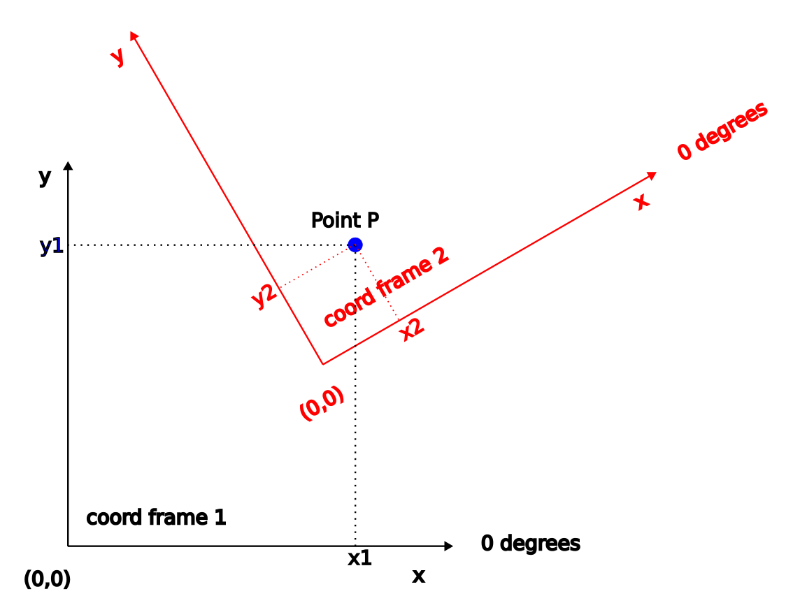

# 2D Frame coordinate transformation

This [source](http://motion.cs.illinois.edu/RoboticSystems/CoordinateTransformations.html) has been used for calculations.



Assuming `p2=[x2, y2]` are represented in coordinate frame 2 (X2,Y2), we would like to find `p1=[x1,y1]` in coordinate frame 1 (X1,Y1).

For this, we need to do calcualte translation and rotation.

Lets assume `o2=(ox,oy)` represents the centre and $\theta$ is the angle of the frame 2 in frame 1 coordinates.

$p_1 = R(\theta) p_2 + o_2 $

where R(\theta) is the rotation matrix

## How to use

Initialise the class by giving the o2 and $\theta$ 

```
Transformer myTransformer(ox, oy, theta);
```

now you can use myTransformer to transform any point to the main coordinate system

```
(x1,y1)=myTransformer.apply(x2,y2);
```

## How it works

In order to work easier with matrices, we implemented `Matrix(..., ...)` class which has following methods (max size is 2):

* Add
* Subtract
* Multiply

$R(\theta) $ is a function that takes in `theta` and returns back the rotation matrix in `Matrix` form.